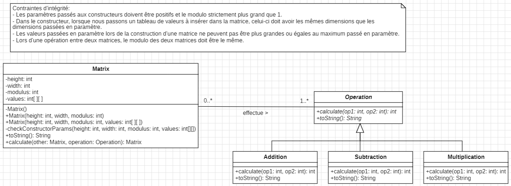

# POO - Labo 5

- Groupe: L05GrK
- Etudiants: Calum Quinn, Dylan Ramos
- Date de dernière modification: 23.10.2023

## 1. Modélisation UML

## 2. Choix de conception

### 2.1. Classe `Matrix`

La classe `Matrix` contient des atrributs non modifiables, c'est-à-dire que lorsqu'une matrice est créée, les
dimensions, les valeurs et le modulo de celles-ci ne pourront pas être changés.

Elle contient différents constructeurs, dont un par défaut qui est défini mais n'est pas utilisé dans le programme. Les
autres constructeurs permettent de créer une matrice avec des dimensions et des valeurs données, ou encore de créer une
matrice avec des dimensions données mais des valeurs générées aléatoirement. A noter que la
méthode `checkConstructorParams()` est appelée dans tous les constructeurs (publics) afin de vérifier que les paramètres
donnés sont valides.

La méthode `calculate()` effectue une opération donnée en paramètre entre la matrice appelante et la matrice passée en
paramètre. Cette méthode permet de faire des opérations entre deux matrices sans modifier les matrices originales. De
plus, elle factorise le code commun à toutes les opérations.

### 2.2. Classe `Operation`

La classe `Operation` est une classe abstraite qui contient une méthode abstraite `calculate()` et une méthode
abstraite `toString()`. Cela permet de factoriser le code commun à toutes les opérations et de pouvoir facilement
ajouter de nouvelles opérations. Ainsi nous faisons hériter chaque opération de la classe `Operation` et respectons l'enoncé qui
demande de *"Définir des objets représentant
l'opération à effectuer"*.

## 3. Tests effectués

Nous avons testé chaque contrainte d'intégrité du diagramme UML manuellement. Pour chacune des contraintes, nous avons 
à chaque fois une `RuntimeException` qui est levée lors d'une erreur, comme demandé dans l'énoncé.